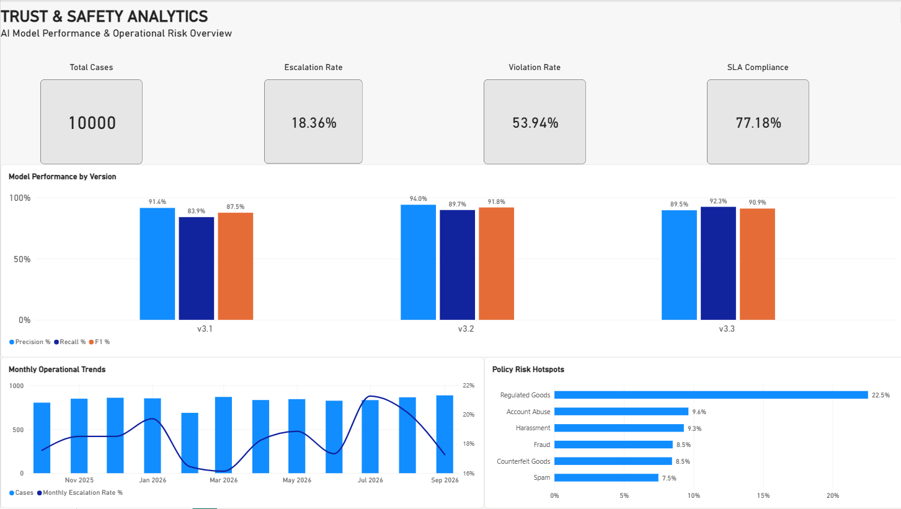
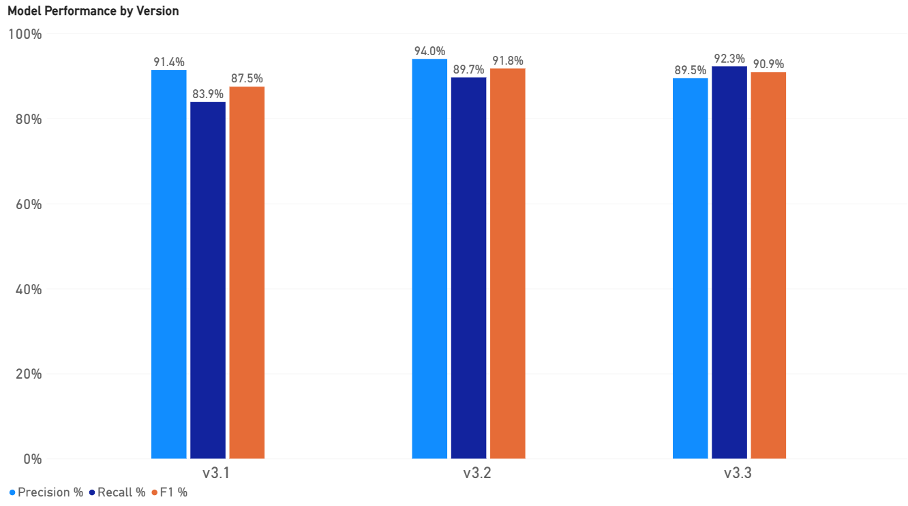
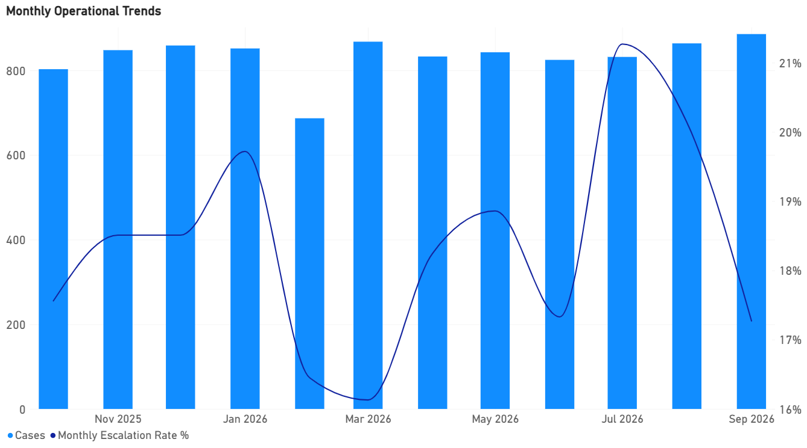
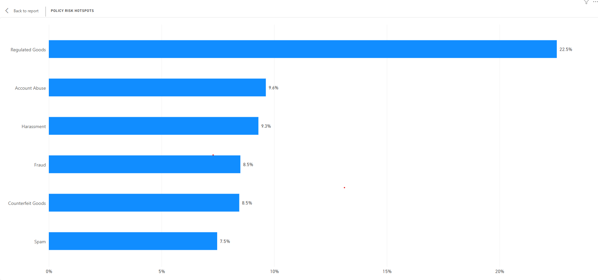
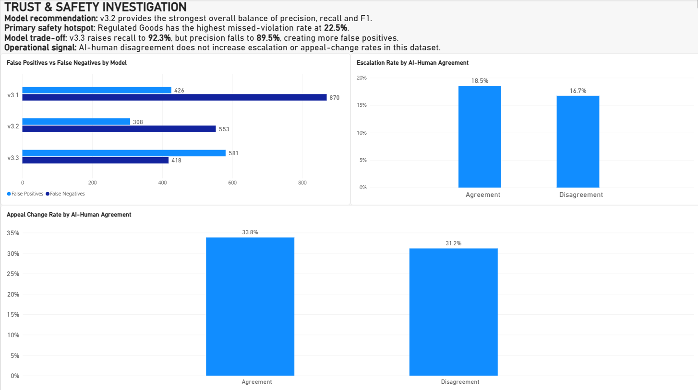
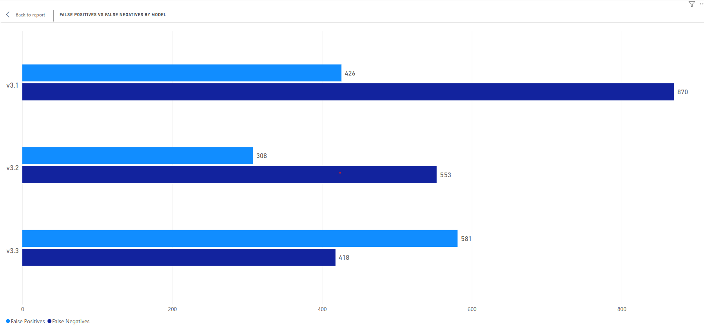
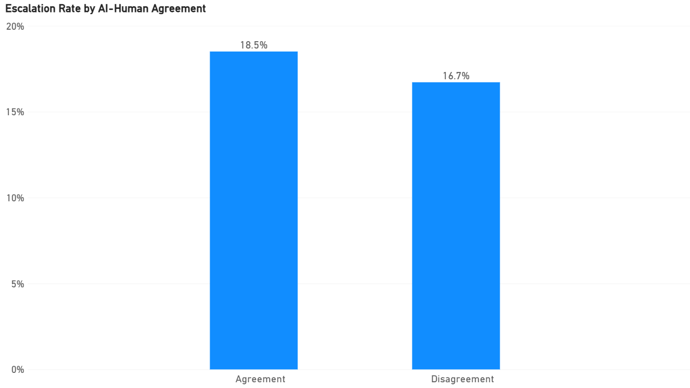
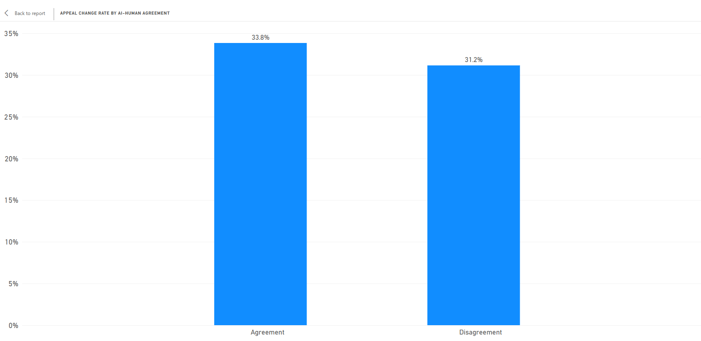

# Trust & Safety Analytics: AI Model Evaluation & Operational Risk

## Overview

End-to-end Trust & Safety analytics project using PostgreSQL, SQL and Power BI to evaluate AI moderation models, identify policy risk, and analyse operational performance.

The project demonstrates skills relevant to Trust & Safety Analytics, AI/ML quality analysis, SQL, data quality, operational analytics and risk prioritisation.

## Power BI Dashboard

### Executive Dashboard



A high-level view of Trust & Safety KPIs, AI model performance, operational trends and policy-level risk indicators.

### Model Performance



This chart compares precision, recall and F1 across three AI moderation model versions to evaluate changes in detection quality and the trade-off between catching violations and avoiding false positives.

**Key finding:** v3.2 provides the strongest overall balance of precision, recall and F1, while v3.3 achieves the highest recall at the cost of lower precision.

### Monthly Operational Trends



This chart tracks monthly Trust & Safety case volume and escalation rate to show how operational workload and escalation pressure changed over time.

### Policy Risk Hotspots



This chart compares missed-violation rates across policy categories to identify where the moderation model is most likely to miss genuine policy violations.

**Key finding:** Regulated Goods has the highest missed-violation rate at 22.5%, making it the primary synthetic model-risk hotspot.

### Trust & Safety Investigation



A deeper investigation view focused on model error trade-offs, AI-human agreement, escalation behaviour, appeal outcomes and analytical recommendations.

### Model Error Analysis



This chart compares false-positive and false-negative volumes across model versions, helping assess the safety and operational trade-offs introduced by each release.

**Key finding:** v3.3 reduces false negatives but produces substantially more false positives than v3.2.

### Escalation Analysis



This chart compares escalation rates for cases where the AI prediction agreed or disagreed with the human review decision, testing whether model disagreement is associated with greater operational escalation.

**Result:** In this synthetic dataset, disagreement does not lead to a higher escalation rate; disagreement cases show 16.7% versus 18.5% for agreement cases.

### Appeal Analysis



This chart compares appeal-change rates between AI-human agreement and disagreement cases to assess whether model disagreement is associated with different appeal outcomes.

**Result:** Appeal-change rates are similar between agreement and disagreement cases, at 33.8% and 31.2% respectively.

## Tools

- PostgreSQL
- DBeaver
- Power BI Desktop
- DAX
- GitHub

## Dataset

Synthetic Trust & Safety dataset covering approximately 10,000 cases, users, policies, human reviews, AI predictions, model versions, escalations and appeals.

**Important:** All data, model behaviour, thresholds and results are synthetic and were created for portfolio demonstration purposes. They should not be interpreted as real-platform evidence.

## Key Analysis

### AI Model Evaluation

| Model | Precision | Recall | F1 |
|---|---:|---:|---:|
| v3.1 | 91.4% | 83.9% | 87.5% |
| **v3.2** | **94.0%** | **89.7%** | **91.8%** |
| v3.3 | 89.5% | **92.3%** | 90.9% |

**Recommendation:** v3.2 is the preferred baseline model in this synthetic analysis. v3.3 improves recall but creates more false positives.

### Policy Risk

**Regulated Goods** is the main synthetic safety hotspot, with a **22.5% missed-violation rate**.

### Operational KPIs

| KPI | Result |
|---|---:|
| Total Cases | 10,000 |
| Violation Rate | 53.94% |
| Escalation Rate | 18.36% |
| SLA Compliance | 77.18% |

### AI-Human Agreement

For model v3.2, disagreement did **not** increase escalation or appeal-change rates in this dataset.

| Status | Escalation Rate | Appeal Change Rate |
|---|---:|---:|
| Agreement | 18.5% | 33.8% |
| Disagreement | 16.7% | 31.2% |

## SQL Skills Demonstrated

- Joins and aggregations
- CTEs
- CASE logic
- Window functions
- Date/time analysis
- Precision, recall and F1 calculation
- SLA analysis
- Operational KPI reporting
- Risk prioritisation
- Reusable SQL views
- Data quality validation

## Project Structure

```text
trust-safety-analytics/
├── README.md
├── sql/
│   ├── 01_schema.sql
│   ├── 02_data_generation.sql
│   ├── 03_views.sql
│   ├── 04_operational_analysis.sql
│   └── 05_triage_analysis.sql
├── powerbi/
│   └── Trust_Safety_Analytics.pbix
├── screenshots/
│   ├── Executive_Dashboard.PNG
│   ├── Trust_Safety_Investigation.PNG
│   ├── Model_Performance.PNG
│   ├── Monthly_Operational_Trends.PNG
│   ├── Policy_Risk_Hotspots.PNG
│   ├── False_Positive_Negative_Analysis.PNG
│   ├── Escalation_Rate_Agreement.PNG
│   └── Appeal_Change_Rate_Agreement.PNG
└── documentation/
```

## Key Takeaways

- **v3.2** is the preferred baseline model in the synthetic analysis.
- **Regulated Goods** is the primary model-risk hotspot.
- Model release analysis highlights a clear precision/recall trade-off.
- Operational and model metrics were combined to support Trust & Safety decision-making.
- The project demonstrates how SQL analysis can be translated into an executive Power BI dashboard.

## Author

**Klaudiusz Nowakowski**
